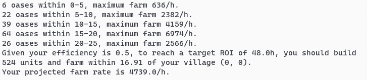

# :crossed_swords: travian-raid-troop-calculator

Travian Raid Troop Calculator is a Python tool used to calculate how many troops you should build given the farms around you. It is designed to calculate an optimal number of troops to build to rush for a second village within the beginner's protection period.

Note that this tool uses your cookie to scan the map around your village. However, this tool does not automate any actions on the account or resemble any premium features, and thus should be exempt from §3 of [game rules](https://www.travian.com/us/gamerules). However, I still strongly recommend you to review the code to ensure that the cookie is not being used in a non-malicious way and make your own decision whether to utilize this tool or not.

## :hammer_and_wrench: Prerequisites

* Python 3
* Python packages (available on [pip](https://pypi.org/project/pip/))
  * `cv2`
  * `numpy`
  * `requests`

## :page_with_curl: How to use

1. Clone or download this repo.
2. Run the following and follow the prompt:
```
python <containing-folder-path>/calculator.py
```
3. When prompted about JWT, log into Travian and retrieve your JWT from your browser cookies.
  * On Chrome, this value is `Menu > More tools > Developer tools > Application > Storage > Cookies > JWT`

This should give you something like the following:



You can also edit the `calculator.py` and pre-populate some fields to save some time over repeated runs. Here are a list of parameters that you can tune:

* `server`: the server you are playing on, e.g. `'ts1.x1.america.travian.com'`
* `jwt`: find in your browser cookie, see above
* `unit`: one of the following:
  * `dm.Troop.CLUBSWINGER`
  * `dm.Troop.LEGIONNAIRE`
  * `dm.Troop.EQUITES_IMPERATORIS`
  * `dm.Troop.PHALANX`
  * `dm.Troop.THEUTATES_THUNDER`
  * You may also define your own or add more in `datamodels.py`
* `target_roi`: return of investment in hours, e.g. 48
* `efficiency`: how efficient you are at farming, from 0-1
* `location`: location of your village

## :mortar_board: Theory

When we fix the number of hours of the return of investment (ROI), we can calculate the maximum distance a single troop may travel to recuperate its production cost. Given that each farm has finite production and thus we can only send a finite number of troops to it each other, we can calculate the maximum number of troops to build before any new troop will be not worth it.

This assumes that all troops are built instantly and all oases are clear of wild animals. This is often not the case. To account for this, you should lower your `efficiency` parameter when running the script.
